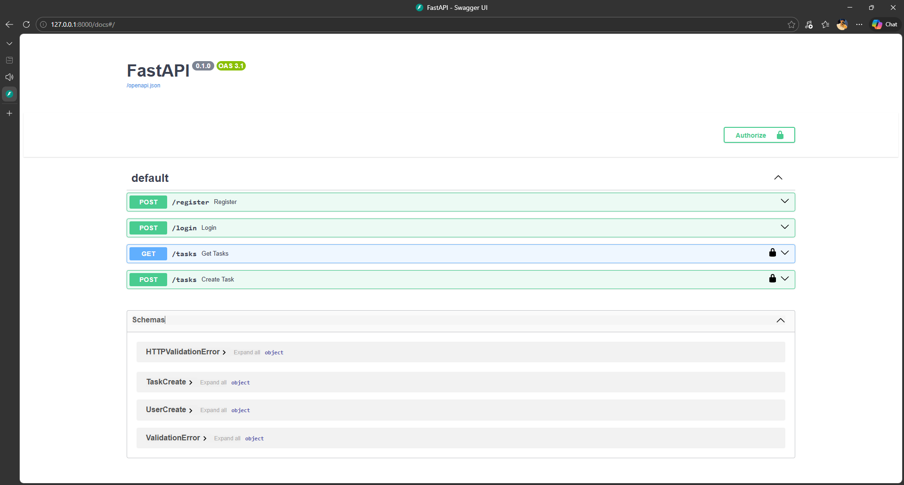
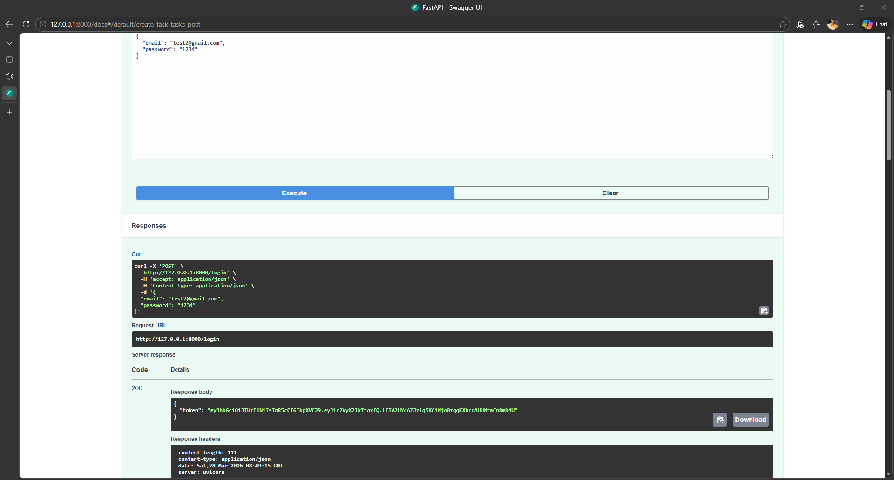
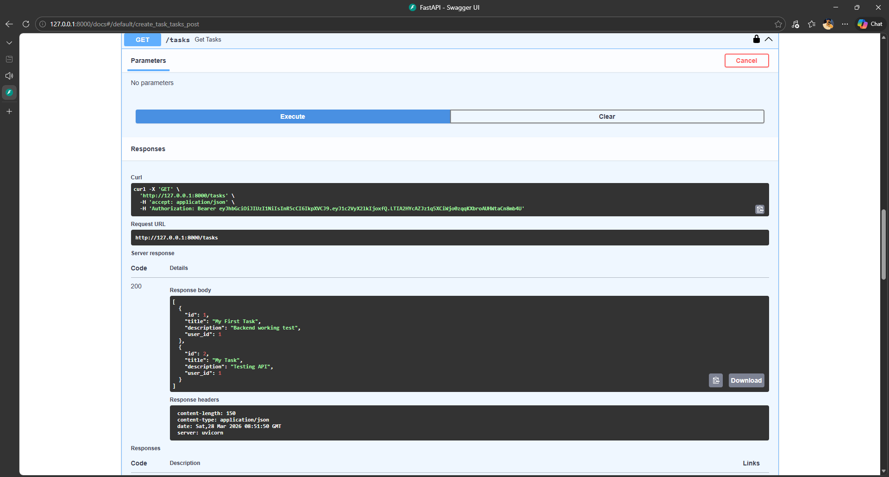

# 🚀 TaskFlow API (FastAPI + JWT Auth)

A production-ready Task Management REST API built using FastAPI with secure JWT Authentication.

---

## 🔥 Features

✔️ User Registration & Login
✔️ Secure Password Hashing (bcrypt)
✔️ JWT Authentication
✔️ Create Tasks
✔️ Get Tasks (Protected Routes 🔒)
✔️ SQLite Database Integration

---

## 🛠 Tech Stack

* FastAPI
* Python
* SQLite
* SQLAlchemy
* JWT (python-jose)
* Passlib (bcrypt)

---

## ⚡ API Endpoints

| Method | Endpoint  | Description               |
| ------ | --------- | ------------------------- |
| POST   | /register | Register a new user       |
| POST   | /login    | Authenticate user         |
| GET    | /tasks    | Get all tasks (Protected) |
| POST   | /tasks    | Create task (Protected)   |

---

## ▶️ Run Locally

```bash
git clone https://github.com/shauryadubey91/taskflow-api.git
cd taskflow-api
pip install -r backend/requirements.txt
uvicorn backend.main:app --reload
```

---

## 🔐 Authentication

1. Login using `/login`
2. Copy the JWT token
3. Click **Authorize** in Swagger UI
4. Enter:

```
Bearer <your_token>
```

---

## 📸 Screenshots

### Swagger UI



### Login API (JWT Token)



### Tasks API Response



---

## 📌 Future Improvements

* [ ] User-specific task filtering
* [ ] Update & Delete APIs
* [ ] Deployment (Render / Railway)
* [ ] Frontend Integration

---

## 👨‍💻 Author

**Shaurya Dubey**
Aspiring Backend & AI/ML Developer 🚀
